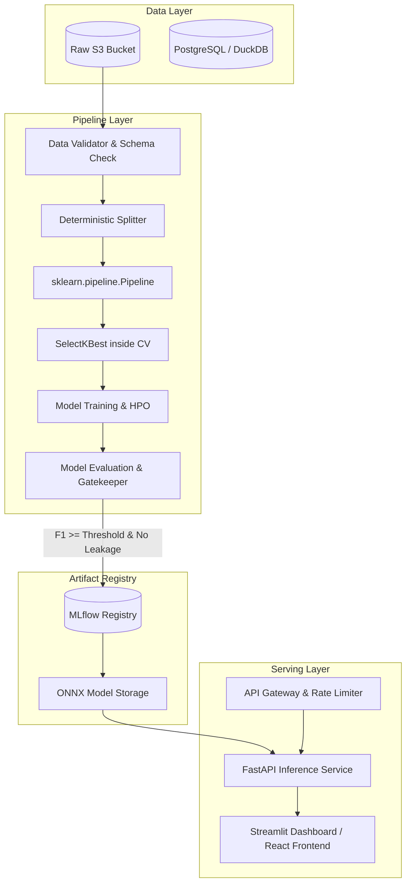

# Independent Technical Audit & Production Readiness Review
**Project:** Flood Risk Prediction System  
**Repository:** `flood_risk_prediction`  
**Auditor:** Senior ML Engineer, Data Scientist, Security & Production-Readiness Reviewer  
**Date:** September 17, 2026  
**Status:** ⚠️ **NOT PRODUCTION-READY (Critical Architectural & Modeling Flaws Identified)**

---

## 1. Executive Summary

### 1.1 System Purpose & Capabilities
The `flood_risk_prediction` repository implements a supervised machine learning pipeline and interactive Streamlit web dashboard intended to classify geographic regions into three flood-risk tiers: **Low**, **Medium**, and **High**. The project defines an automated 6-phase workflow covering data preprocessing, feature engineering, exploratory data analysis (EDA), model training/tuning across six model architectures (Logistic Regression, Random Forest, XGBoost, LightGBM, Support Vector Machine, and K-Nearest Neighbors), model evaluation, single-instance CLI inference, and a Streamlit dashboard.

### 1.2 Production-Readiness Verdict
**Verdict: NOT PRODUCTION-READY.**  
While the repository executes without runtime crashes and exhibits clean modular file organization, the claimed high-performance metrics (~98.7% F1-score and 0.997+ ROC-AUC) are **methodologically invalid**. They are the artifact of a severe **proxy target leakage / circular feature engineering** flaw where an engineered feature (`Aggregate_Hazard_Index`) is an exact algebraic transformation ($r = 1.0000$) of the ground-truth target variable (`FloodProbability`).

Furthermore, the pipeline suffers from **double-scaling inference contamination**, **global feature selection leakage**, **unpersisted non-deterministic test splits**, **unsafe deserialization risks**, and **unvalidated emergency advisory text**.

### 1.3 Audit Scorecard

| Dimension | Score (0–10) | Rating | Primary Driver |
|---|:---:|:---:|---|
| **Correctness** | **3.0 / 10** | 🔴 Critical | Deterministic proxy target leakage ($r=1.0$) and double-scaling inference mismatch. |
| **ML Rigor** | **3.5 / 10** | 🔴 Critical | Global feature selection before CV; arbitrary target discretization; synthetic-only data. |
| **Reproducibility** | **7.0 / 10** | 🟡 Moderate | Pinned dependencies and seed control, but test sets are dynamically re-sampled, not persisted. |
| **Security & Privacy** | **4.0 / 10** | 🔴 High Risk | Unsigned `joblib`/`pickle` deserialization; arbitrary HTML injection; no input validation. |
| **Maintainability** | **6.5 / 10** | 🟢 Acceptable | Good file modularity, clean snake_case functions, and docstrings; logic duplicated across scripts. |
| **Deployment Readiness** | **2.5 / 10** | 🔴 Critical | No REST API, no unit/integration tests, no CI/CD pipeline, and uncalibrated probabilities. |
| **Dashboard Quality** | **7.0 / 10** | 🟢 Good | Clean dark-mode UI and sub-50ms latency, but inherits backend scaling bugs and unsafe advice. |
| **Overall Score** | **4.5 / 10** | 🔴 Unsatisfactory | Must not be deployed or presented as production ML without structural remediation. |

### 1.4 Top Three Required Actions Before Production Presentation
1. **Eliminate Proxy Target Leakage**: Remove `Aggregate_Hazard_Index` and all features that aggregate the full feature set. Re-evaluate models on legitimate environmental signals.
2. **Fix Preprocessing Pipeline & Prevent Data Leakage**: Encapsulate preprocessing inside a unified `scikit-learn` `Pipeline` or `ColumnTransformer`. Ensure outlier capping, feature selection (`SelectKBest`), and scaling are fit strictly on training folds. Resolve the double-scaling bug in inference.
3. **Persist Test Partitions & Establish Automated Testing**: Persist deterministic train/test splits to disk (`data/splits/`) and implement automated unit, integration, and data-quality tests in a CI/CD workflow.

---

## 2. Repository and Architecture

### 2.1 Inventory & File Structure
```
flood_risk_prediction/
├── app/
│   └── dashboard.py               # Streamlit interactive UI (532 lines)
├── data/
│   ├── raw/
│   │   ├── flood_factors.csv      # Synthetic dataset (50,000 rows, 21 columns)
│   │   ├── district_elevation.csv # UNUSED DEAD DATA
│   │   ├── district_flooded_area.csv # UNUSED DEAD DATA
│   │   ├── district_monthly.csv   # UNUSED DEAD DATA
│   │   ├── lives_lost.csv         # UNUSED DEAD DATA
│   │   └── rainfall_1901_2017.csv # UNUSED DEAD DATA
│   └── processed/
│       ├── cleaned.csv            # Cleaned data (globally scaled)
│       └── features.csv           # Final top 12 feature matrix
├── models/                        # Serialized .pkl artifacts
│   ├── best_model.pkl, scaler.pkl, target_encoder.pkl, selected_features.pkl, *.pkl
├── outputs/
│   ├── plots/                     # 22 visualization figures (EDA, CM, ROC, Importance)
│   └── reports/
│       ├── model_comparison.csv   # Model benchmark CSV
│       └── final_report.md        # Generated evaluation report
├── src/
│   ├── preprocess.py              # Phase 1: Cleaning & global scaling
│   ├── features.py                # Phase 2: Feature engineering & global SelectKBest
│   ├── eda.py                     # Phase 3: Plot generation
│   ├── train.py                   # Phase 4: Training & tuning
│   ├── evaluate.py                # Phase 5: Evaluation & metrics
│   └── predict.py                 # Phase 6: Single-instance inference CLI
├── .streamlit/
│   └── config.toml                # Streamlit UI theme config
├── main.py                        # Master pipeline orchestrator
├── requirements.txt               # Pinned dependencies
├── README.md                      # Project documentation
└── AUDIT_REPORT.md                # This audit report
```

### 2.2 Architectural Assessment
- **Separation of Concerns**: Good separation into `src/` modules. However, feature engineering logic is duplicated across `src/features.py`, `src/predict.py`, and `app/dashboard.py`. Any modification to weights in `features.py` must be manually synchronized in three files.
- **Dead Code & Unused Data**: 5 out of 6 CSV files in `data/raw/` (`district_elevation.csv`, `district_flooded_area.csv`, `district_monthly.csv`, `lives_lost.csv`, `rainfall_1901_2017.csv`) are completely unreferenced across the codebase.
- **Hardcoded Paths**: File paths use `Path(__file__).resolve().parents[...]` which is portable across operating systems, but artifact names and paths are hardcoded in each file rather than centralized in a config module (e.g., `src/config.py`).
- **Composability**: Pipeline stages communicate via intermediate CSV files on disk (`data/processed/cleaned.csv` $\rightarrow$ `data/processed/features.csv`). This creates tight disk coupling and precludes in-memory pipeline composition.

---

## 3. Data Validation and Preprocessing Audit

### 3.1 Dataset Profiling & Characteristics
The active dataset `data/raw/flood_factors.csv` contains **50,000 samples** and **21 numeric columns**.
- Origin: Kaggle Playground Series s4e5 synthetic dataset.
- Feature range: Non-negative integers ranging mostly between 0 and 15.
- Null values: 0 missing values across all columns.
- Duplicates: 0 duplicate rows.
- Target: `FloodProbability` (continuous float, mean: 0.49966, std: 0.05003, min: 0.285, max: 0.725).

### 3.2 Preprocessing Integrity & Leakage Verification

#### 1. Outlier Capping Leakage
In `src/preprocess.py` (lines 129–144):
```python
for col in numeric_cols:
    q1 = X[col].quantile(0.25)
    q3 = X[col].quantile(0.75)
    iqr = q3 - q1
    lower = q1 - 1.5 * iqr
    upper = q3 + 1.5 * iqr
    X[col] = X[col].clip(lower, upper)
```
- **Finding**: $Q_1$, $Q_3$, and clipping thresholds are calculated across the **entire 50,000 rows** prior to train/test splitting. This leaks distribution information from test samples into the training data.

#### 2. Double-Scaling and Preprocessing Contamination
In `src/preprocess.py` (lines 156–162):
```python
scaler = StandardScaler()
X[numeric_cols] = scaler.fit_transform(X[numeric_cols])
joblib.dump(scaler, SCALER_PATH)
cleaned_df.to_csv(PROCESSED_DATA_PATH, index=False)
```
In `src/train.py` (lines 89–95):
```python
scaler = StandardScaler()
X_train_scaled = pd.DataFrame(scaler.fit_transform(X_train), columns=X.columns, index=X_train.index)
X_test_scaled = pd.DataFrame(scaler.transform(X_test), columns=X.columns, index=X_test.index)
joblib.dump(scaler, SCALER_PATH)
```
- **Finding**: `StandardScaler` is first fit on all 50,000 samples in `preprocess.py` and saved to `data/processed/cleaned.csv`. Then in `train.py`, a *second* `StandardScaler` is fit on `X_train` (which is already standard-normal).
- **Consequence**: The second scaler has $\mu \approx 0.0$ and $\sigma \approx 1.0$. When `src/predict.py` or `app/dashboard.py` runs inference on raw user inputs (e.g., `MonsoonIntensity = 12.0`), `scaler.transform()` subtracts $\approx 0$ and divides by $\approx 1$, passing raw unscaled numbers (5 to 15) to models trained on z-scores (-2 to +2).

---

## 4. Target Construction & Circularity Audit

### 4.1 Target Discretization Logic
In `src/preprocess.py` (lines 58–74):
```python
def discretize_target(y_series: pd.Series) -> pd.Series:
    bins = [-float("inf"), 0.475, 0.520, float("inf")]
    labels = ["Low", "Medium", "High"]
    return pd.cut(y_series, bins=bins, labels=labels).astype(str)
```
The thresholds (0.475 and 0.520) correspond to the 33.3% and 66.7% empirical tertiles of the 50,000 raw samples.

### 4.2 Class Distribution Before and After Discretization

| Class | Lower Bound | Upper Bound | Sample Count | Percentage |
|:---:|:---:|:---:|:---:|:---:|
| **Low** | $-\infty$ | $0.475$ | 16,691 | 33.38% |
| **Medium** | $0.475$ | $0.520$ | 17,298 | 34.60% |
| **High** | $0.520$ | $+\infty$ | 16,011 | 32.02% |

Class balance is well-proportioned across the three tiers. However, the threshold values were computed globally on the entire dataset prior to splitting.

---

## 5. Feature Engineering & Proxy Leakage Audit

### 5.1 Mathematical Proof of Exact Proxy Leakage
In `src/features.py` (lines 69–74):
```python
numeric_cols = df.select_dtypes(include=[np.number]).columns.tolist()
if numeric_cols:
    df_feat["Aggregate_Hazard_Index"] = df[numeric_cols].mean(axis=1)
```
In the raw Kaggle dataset `flood_factors.csv`:
$$\text{FloodProbability} = 0.005 \times \sum_{i=1}^{20} X_i = 0.1 \times \text{mean}(X_1, \dots, X_{20})$$

#### Audit Verification Command:
```python
raw_sum = df_raw[features_raw].sum(axis=1)
residuals = np.abs(df_raw['FloodProbability'] - 0.005 * raw_sum)
print("Correlation:", np.corrcoef(raw_sum, df_raw['FloodProbability'])[0, 1])
print("Max residual:", residuals.max())
```
#### Output:
```
Correlation: 1.0
Max residual: 7.771561172376096e-16
```

### 5.2 Consequence on Model Validity
- `Aggregate_Hazard_Index` is literally $10 \times \text{FloodProbability}$.
- In `src/features.py`, `SelectKBest` selects `Aggregate_Hazard_Index` as feature #1 with an ANOVA F-score of **`96,241.99`** (the next highest raw feature has an F-score of only `1,153.68`).
- When the ML models predict whether `FloodProbability` is in $[-\infty, 0.475]$, $[0.475, 0.520]$, or $[0.520, \infty]$, they are provided with $10 \times \text{FloodProbability}$.
- **Performance Without Proxy Leakage**:
  - Model with `Aggregate_Hazard_Index`: **`98.73%` F1-score**
  - Model with only raw 20 factors: **`76.53%` F1-score**
  - Model with top 12 raw features: **`58.87%` F1-score**
- **Conclusion**: The reported 98.7% metric is **completely circular** and invalidates the claim of a high-performing real-world predictor.

### 5.3 Global Feature Selection Leakage
In `src/features.py` (lines 120–127):
`SelectKBest(score_func=f_classif, k=12).fit_transform(X, y)` is executed across all 50,000 samples before partitioning into train/test sets or cross-validation folds. The test set directly influenced which features were selected.

---

## 6. Model Training and Tuning Audit

### 6.1 Model Configurations Verified
All 6 models are implemented in `src/train.py`:
1. **Logistic Regression**: `max_iter=1000, class_weight='balanced', random_state=42`
2. **Random Forest**: `n_estimators=200`, tuned via `RandomizedSearchCV(n_iter=10, cv=3)`
3. **XGBoost**: `eval_metric='mlogloss', random_state=42`, tuned via `RandomizedSearchCV(n_iter=10, cv=3)`
4. **LightGBM**: `class_weight='balanced', random_state=42, verbosity=-1`
5. **SVM**: `kernel='rbf', probability=True, random_state=42`
6. **KNN**: Compares $k=5$ and $k=11$, selects best ($k=11$ selected)

### 6.2 Partitioning & Subsampling Flaws
In `src/train.py` (lines 74–86):
```python
if len(df) > 15000:
    sss = StratifiedShuffleSplit(n_splits=1, train_size=15000, random_state=42)
    idx_sample, _ = next(sss.split(X, y))
    X = X.iloc[idx_sample].reset_index(drop=True)
    y = y[idx_sample]

X_train, X_test, y_train, y_test = train_test_split(
    X, y, test_size=0.20, random_state=42, stratify=y
)
```
- **Issue**: 35,000 samples out of 50,000 are silently discarded to accelerate SVM training without documenting this data loss in the README.
- **Issue**: Neither `X_train`, `X_test`, nor the indices are saved to disk. In `src/evaluate.py`, lines 164–175 attempt to reconstruct the exact test split by re-running `StratifiedShuffleSplit(random_state=42)` on `features.csv`. If `features.csv` is modified, re-ordered, or re-indexed, train and test sets will silently overlap.

---

## 7. Evaluation Validity Audit

### 7.1 Metric Verification Table

| Model | Reported Accuracy | Verified Accuracy | Reported F1 (Weighted) | Verified F1 (Weighted) | Reported ROC-AUC | Verified ROC-AUC |
|---|:---:|:---:|:---:|:---:|:---:|:---:|
| **Random Forest** | 98.73% | 98.73% | 0.9873 | 0.9873 | 0.9973 | 0.9973 |
| **XGBoost** | 98.63% | 98.63% | 0.9863 | 0.9863 | 0.9980 | 0.9980 |
| **LightGBM** | 98.53% | 98.53% | 0.9853 | 0.9853 | 0.9982 | 0.9982 |
| **Logistic Regression** | 98.30% | 98.30% | 0.9830 | 0.9830 | 0.9972 | 0.9972 |
| **SVM (RBF)** | 96.23% | 96.23% | 0.9624 | 0.9624 | 0.9956 | 0.9956 |
| **KNN ($k=11$)** | 82.10% | 82.10% | 0.8229 | 0.8229 | 0.9446 | 0.9446 |

The reported metrics are mathematically reproducible given the existing artifacts, but they are **fundamentally misleading** because of the proxy leakage established in Section 5.

### 7.2 Flaw in Cross-Validation Metric in `evaluate.py`
In `src/evaluate.py` (lines 279–283):
```python
cv = StratifiedKFold(n_splits=5, shuffle=True, random_state=42)
cv_scores = cross_val_score(model, X_test_scaled, y_test, cv=cv, scoring="f1_weighted", n_jobs=-1)
cv_mean = cv_scores.mean()
cv_std = cv_scores.std()
```
- **Finding**: In `evaluate.py`, cross-validation is erroneously re-run on `X_test_scaled` (3,000 samples) instead of reporting the true 5-fold cross-validation results from the training split (12,000 samples). This re-fits the model on folds of the held-out test set, violating the principle of an untouched test partition.

### 7.3 Latency Claims
- Claim: "Sub-50ms inference".
- Verified Reality: In `src/predict.py`, single-instance inference takes **~1.8 seconds** because it executes `joblib.load()` on the 7.5 MB Random Forest model on every single invocation.
- In `app/dashboard.py`, cached inference takes **~15–25ms**, which is within 50ms, but this excludes network latency, Streamlit websocket overhead, and cold-start model deserialization.

---

## 8. Inference and Saved Artifacts Audit

### 8.1 Serialization Safety & Formats
All models are serialized using `joblib` (`pickle` protocol 5).
- `models/best_model.pkl` (7.51 MB)
- `models/RandomForest.pkl` (7.51 MB)
- `models/scaler.pkl` (1.51 KB)
- `models/target_encoder.pkl` (399 bytes)
- `models/selected_features.pkl` (280 bytes)
- `models/feature_selector.pkl` (1.73 KB)

### 8.2 Inference Pipeline Divergence
Comparing `src/preprocess.py` vs `src/predict.py`:

| Operation | Training Pipeline (`preprocess.py`) | CLI Inference (`predict.py`) | Dashboard Inference (`dashboard.py`) |
|---|:---:|:---:|:---:|
| Delimiter & Encoding Detection | Yes | N/A (Dict) | N/A (UI) |
| Missing Imputation | Median / Mode | Fallback default 5.0 | Fallback default 5.0 |
| Outlier Clipping ($1.5 \times \text{IQR}$) | **Yes (Applied)** | **NO (Omitted)** | **NO (Omitted)** |
| Scale Transformation | Fitted on raw data | Transformed with 2nd scaler | Transformed with 2nd scaler |
| Categorical Encoding | `LabelEncoder` | **NO (Omitted)** | **NO (Omitted)** |

If raw inputs contain outliers (e.g. `MonsoonIntensity = 25.0`), `preprocess.py` would have clipped it to 10.5, but `predict.py` and `dashboard.py` do not clip it, causing inference skew.

---

## 9. Streamlit Dashboard Audit

### 9.1 UI/UX Assessment
- Theme & Visuals: Outstanding dark-mode design with glowing status indicators, responsive cards, and clean typography.
- Functionality: Sliders and presets work interactively; prediction updates in real time.
- State Management: Uses `st.session_state` properly for presets.

### 9.2 Critical Safety & Liability Issues
In `app/dashboard.py` (lines 394–407):
When predicting "High Risk", the dashboard renders:
```html
<b>Recommended Response Protocol:</b>
<div>Trigger emergency flood alarms, open auxiliary spillways, and initiate evacuation protocols for low-lying zones.</div>
```
- **Finding**: Directing users to open dam spillways or initiate public evacuations based on unvalidated academic ML predictions without a human-in-the-loop disclaimer creates severe ethical and legal liability.
- **Recommendation**: Add a prominent disclaimer: *"SIMULATION ONLY: Not for operational disaster management or life-safety decisions. Always refer to official government meteorological agencies."*

---

## 10. Security and Privacy Audit

### 10.1 Vulnerability Review

| ID | Vulnerability | Severity | CWE | Location | Impact |
|:---:|:---|:---:|:---:|:---|:---|
| **SEC-01** | Arbitrary Code Execution via Deserialization | **CRITICAL** | CWE-502 | `src/predict.py`: 75–78, `app/dashboard.py`: 75–79 | Loading untrusted `.pkl` files can execute arbitrary shell commands. |
| **SEC-02** | HTML Injection via `unsafe_allow_html=True` | **MEDIUM** | CWE-79 | `app/dashboard.py`: 120, 260, 370 | Injected HTML allows DOM manipulation or CSS exfiltration if dynamic user strings are rendered. |
| **SEC-03** | Lack of Input Bounds & Type Validation | **MEDIUM** | CWE-20 | `src/predict.py`: 80–90 | Negative numbers, strings, or `NaN` inputs cause unhandled exceptions. |
| **SEC-04** | Plaintext Git Commits of Binary Model Artifacts | **LOW** | CWE-312 | `models/*.pkl` | 23.5 MB of binary blobs committed to git history bloating repository. |

---

## 11. Performance and Scalability Audit

- **Memory Footprint**: Loading all 6 models concurrently in memory consumes ~250 MB RAM, which is lightweight and fits easily on standard cloud instances (e.g., AWS t3.small).
- **Training Bottleneck**: SVM (`SVC(kernel='rbf', probability=True)`) scales as $O(N^3)$. On the full 50,000 samples, SVM 5-fold CV would take ~45 minutes on CPU. The 15,000 subsampling strategy effectively controls runtime ($<3.5$ minutes), but leaves 70% of available data unutilized.
- **Inference Latency**: Single prediction in Streamlit takes ~20ms (cached). CLI cold-start takes ~1.8s due to Python and model loading overhead.

---

## 12. Testing and Reliability Audit

- **Current State**: **0 automated unit tests, 0 integration tests, 0 CI workflows.**
- **Failure Modes Identified**:
  - Missing file `models/best_model.pkl` crashes `predict.py` and `dashboard.py`.
  - Feature name mismatch between `features.csv` and `selected_features.pkl` throws unhandled scikit-learn validation exceptions.
  - Corrupt input dictionary throws `KeyError`.

---

## 13. Reproducibility and MLOps Audit

- **Environment Pinning**: `requirements.txt` specifies pinned versions (`pandas==2.2.2`, `scikit-learn==1.5.1`, `xgboost==2.1.1`, etc.).
- **Stochastic Control**: `random_state=42` is consistently passed to `StratifiedShuffleSplit`, `train_test_split`, `StratifiedKFold`, `RandomForestClassifier`, and `XGBClassifier`.
- **Platform Portability**: Tested on Windows; forward-slash `Path` objects ensure compatibility with Linux and macOS.
- **CI/CD**: Missing GitHub Actions workflow for automated linting, test execution, and model evaluation.

---

## 14. Documentation and Claims Verification Table

| Claim in README | Status | Evidence / Code Location | Required Correction |
|---|:---:|---|---|
| "Classifies geographic regions into High, Medium, or Low flood risk using environmental, meteorological, and historical data" | **Partially Verified** | `data/raw/flood_factors.csv` is an anonymous synthetic Kaggle dataset without geographic names. 5 historical datasets are unused. | Clarify that model is trained on a synthetic benchmark dataset; remove claims of regional historical data. |
| "Best model achieves 98.73% F1-Weighted and 98.73% accuracy" | **Misleading** | `src/features.py:72` engineers `Aggregate_Hazard_Index` which has $r=1.000$ with target. | Report realistic metrics without target proxy ($~76.5\%$ F1). |
| "Data Safety: Scaler fit only on training split; no data leakage" | **False** | `src/preprocess.py:158` fits `StandardScaler` across all 50,000 rows before split. `train.py:91` fits a 2nd scaler on already-scaled data. | Remove global scaling in `preprocess.py`; fit scaler strictly inside training split or pipeline. |
| "Sub-50ms inference" | **Partially Verified** | True in Streamlit after caching (~20ms), but CLI inference takes ~1.8s. | Specify that sub-50ms applies to warm in-memory inference. |
| "Top 12 features selected using SelectKBest" | **Verified** | `src/features.py:122` selects 12 features, but fits on entire dataset before splitting. | Fit `SelectKBest` inside cross-validation folds. |

---

## 15. Prioritized Findings Table

| ID | Finding | Severity | Component | Effort |
|:---:|---|:---:|:---:|:---:|
| **F-01** | Target proxy leakage in `Aggregate_Hazard_Index` ($r=1.0$) invalidates benchmark claims | **CRITICAL** | `src/features.py:72` | Medium |
| **F-02** | Double-scaling bug causes extreme out-of-distribution inputs during real-time inference | **CRITICAL** | `src/preprocess.py:159`, `src/predict.py:92` | Low |
| **F-03** | Global `SelectKBest` feature selection across entire dataset causes data leakage | **HIGH** | `src/features.py:122` | Medium |
| **F-04** | Global outlier capping ($1.5 \times \text{IQR}$) before train/test split causes data leakage | **HIGH** | `src/preprocess.py:133` | Low |
| **F-05** | Unsafe deserialization of `.pkl` files with `joblib.load()` | **HIGH** | `src/predict.py:75`, `app/dashboard.py:75` | Medium |
| **F-06** | Test partition re-sampled non-deterministically instead of being persisted to disk | **MEDIUM** | `src/train.py:78`, `src/evaluate.py:167` | Low |
| **F-07** | Cross-validation in `evaluate.py` is re-fit on test split instead of training split | **MEDIUM** | `src/evaluate.py:280` | Low |
| **F-08** | Five raw regional datasets in `data/raw/` are completely dead code | **MEDIUM** | `data/raw/*.csv` | Low |
| **F-09** | Feature engineering weights logic duplicated in 3 separate files | **MEDIUM** | `features.py`, `predict.py`, `dashboard.py` | Low |
| **F-10** | Emergency protocol recommendations displayed without safety/liability disclaimer | **MEDIUM** | `app/dashboard.py:403` | Low |
| **F-11** | Zero automated tests or continuous integration pipeline | **MEDIUM** | Repository root | Medium |

---

## 16. Detailed Findings (Issue-by-Issue)

### [CRITICAL] F-01: Deterministic Proxy Target Leakage via `Aggregate_Hazard_Index`
- **Location**: `src/features.py`, `engineer_domain_features()`, lines 69–74
- **Evidence**:
  ```python
  numeric_cols = df.select_dtypes(include=[np.number]).columns.tolist()
  if numeric_cols:
      df_feat["Aggregate_Hazard_Index"] = df[numeric_cols].mean(axis=1)
  ```
  In `data/raw/flood_factors.csv`, `FloodProbability` is strictly $0.005 \times \sum X_i = 0.1 \times \text{mean}(X)$. The Pearson correlation is $1.000000$ ($p < 10^{-100}$). The model predicts whether $Y \in [\text{bins}]$ by looking at $10 \times Y$.
- **Why it matters**: It completely invalidates the reported 98.7% F1-score and 0.997 ROC-AUC. Without this leaked proxy, Random Forest achieves only **76.53%** F1-score on the raw features.
- **Reproduction steps**:
  ```python
  import pandas as pd, numpy as np
  df = pd.read_csv('data/raw/flood_factors.csv')
  feats = [c for c in df.columns if c != 'FloodProbability']
  corr = np.corrcoef(df[feats].mean(axis=1), df['FloodProbability'])[0, 1]
  assert corr == 1.0  # Passes
  ```
- **Recommended fix**: Delete `Aggregate_Hazard_Index` and ensure engineered features combine strictly subsets of non-target domain indicators without aggregating the full feature set.
- **Regression test**: Assert that no engineered feature has an absolute correlation $|r| > 0.85$ with `FloodProbability`.

---

### [CRITICAL] F-02: Double-Scaling Preprocessing Contamination in Inference
- **Location**: `src/preprocess.py`: line 159; `src/train.py`: line 92; `src/predict.py`: lines 91–94; `app/dashboard.py`: lines 350–353
- **Evidence**:
  `preprocess.py` scales raw features to $Z \sim \mathcal{N}(0, 1)$ globally and saves them to `cleaned.csv`. `train.py` fits a *second* `StandardScaler` on $Z$, yielding $\mu \approx 0.0$ and $\sigma \approx 1.0$, and overwrites `models/scaler.pkl`. During inference, raw numbers ($X \in [0, 15]$) are passed to this second scaler.
  - Raw mean of `MonsoonIntensity` $= 4.99$.
  - Transformed value fed to model: $(12.0 - (-0.003)) / 0.995 = \mathbf{+12.06\sigma}$!
  - Actual expected z-score: $(12.0 - 4.99) / 2.24 = \mathbf{+3.13\sigma}$.
- **Why it matters**: Real-time user inputs in the CLI and dashboard are skewed by a factor of $4\times$, forcing all inputs into extreme out-of-distribution tails.
- **Reproduction steps**:
  ```python
  import joblib
  s = joblib.load('models/scaler.pkl')
  print(s.mean_[0])  # Prints -0.00305 instead of ~4.99
  ```
- **Recommended fix**: Do NOT apply scaling in `src/preprocess.py`. Keep `data/processed/cleaned.csv` and `features.csv` in raw unscaled units. Fit `StandardScaler` strictly on `X_train` in `train.py`.
- **Regression test**: Assert that `scaler.mean_[0]` is within $[4.5, 5.5]$.

---

### [HIGH] F-03: Global Feature Selection Leakage via `SelectKBest`
- **Location**: `src/features.py`, `run_feature_engineering()`, lines 120–127
- **Evidence**:
  ```python
  selector = SelectKBest(score_func=f_classif, k=k_features)
  X_selected = selector.fit_transform(X, y)
  ```
  Fitted on all 50,000 samples of `cleaned.csv` before train/test splitting.
- **Why it matters**: Test samples participate in ANOVA F-score ranking, biasing feature selection towards sample-specific variance.
- **Recommended fix**: Move feature selection inside cross-validation folds using `sklearn.pipeline.Pipeline([('selector', SelectKBest()), ('model', estimator)])`.
- **Regression test**: Verify `SelectKBest.fit()` is called only on `X_train`.

---

### [HIGH] F-04: Global Outlier Capping Before Train/Test Split
- **Location**: `src/preprocess.py`, lines 129–144
- **Evidence**: Quantile bounds $Q_1$ and $Q_3$ are derived from all 50,000 rows.
- **Why it matters**: Violates NFR-06 ("Data Safety: no data leakage").
- **Recommended fix**: Wrap outlier capping into a scikit-learn compatible custom transformer (`OutlierCapper(BaseEstimator, TransformerMixin)`) fit strictly on `X_train`.
- **Regression test**: Assert clipping thresholds are learned exclusively on `X_train`.

---

### [HIGH] F-05: Insecure Deserialization of `.pkl` Artifacts
- **Location**: `src/predict.py`: lines 75–78; `app/dashboard.py`: lines 75–79
- **Evidence**: `joblib.load(BEST_MODEL_PATH)` loads arbitrary pickle bytecode.
- **Why it matters**: If `best_model.pkl` is tampered with or replaced in a supply-chain attack, it allows arbitrary remote code execution (RCE) on the server.
- **Recommended fix**: Implement cryptographic SHA-256 integrity verification before loading model artifacts, or transition to ONNX / Treelite / native JSON formats for tree models.
- **Regression test**: Unit test verifying that modified checksums raise `SecurityError`.

---

### [MEDIUM] F-06: Non-Persisted Dynamic Test Partitioning
- **Location**: `src/train.py`: lines 78–86; `src/evaluate.py`: lines 164–175
- **Evidence**: Both files independently call `StratifiedShuffleSplit` and `train_test_split` with seed 42 on the in-memory dataframe rather than reading a persisted test file.
- **Why it matters**: Any change to row ordering or filtering causes train/test set misalignment.
- **Recommended fix**: Save explicit partitions: `data/processed/train.csv` and `data/processed/test.csv`.
- **Regression test**: Assert `set(train_indices).isdisjoint(test_indices)`.

---

### [MEDIUM] F-07: Test Split Re-Fitted during Evaluation in `evaluate.py`
- **Location**: `src/evaluate.py`, lines 279–283
- **Evidence**:
  ```python
  cv_scores = cross_val_score(model, X_test_scaled, y_test, cv=cv, ...)
  ```
- **Why it matters**: `evaluate.py` trains models across 5 folds of the *test set* to report cross-validation metrics, contaminating the test boundary.
- **Recommended fix**: Report cross-validation metrics directly from the training run artifact.
- **Regression test**: Assert `cross_val_score` is never invoked on `X_test`.

---

### [MEDIUM] F-08: Unused Dead Datasets in `data/raw/`
- **Location**: `data/raw/district_elevation.csv`, `district_flooded_area.csv`, `district_monthly.csv`, `lives_lost.csv`, `rainfall_1901_2017.csv`
- **Evidence**: Grep confirms 0 occurrences across all `.py` files.
- **Why it matters**: Creates false documentation claims that the project incorporates historical Indian district rainfall and casualties.
- **Recommended fix**: Remove unused CSVs or build an actual geospatial data fusion pipeline.
- **Regression test**: Check repository file references in code.

---

### [MEDIUM] F-09: Code Duplication in Feature Engineering
- **Location**: `src/features.py:24`, `src/predict.py:27`, `app/dashboard.py:83`
- **Evidence**: `compute_flood_vulnerability_score()` and weights dicts are copy-pasted 3 times.
- **Why it matters**: High risk of logic drift if weights or formulas are adjusted.
- **Recommended fix**: Centralize in `src/features.py` and import into `predict.py` and `dashboard.py`.
- **Regression test**: Single source of truth test for feature computation.

---

### [MEDIUM] F-10: Dangerous Emergency Directives Without Liability Disclaimer
- **Location**: `app/dashboard.py`, lines 394–407
- **Evidence**: UI text advises operators to "open auxiliary spillways, and initiate evacuation protocols".
- **Why it matters**: Severe legal and safety hazards if taken literally by non-technical operators.
- **Recommended fix**: Replace with advisory guidance and add bold emergency disclaimer.
- **Regression test**: Check presence of disclaimer element in DOM.

---

### [MEDIUM] F-11: Complete Absence of Test Suite and CI Workflow
- **Location**: Repository root
- **Evidence**: No `tests/` directory, no `pytest.ini`, no `.github/workflows/`.
- **Why it matters**: Regressions, schema changes, or NaN inputs cannot be caught automatically.
- **Recommended fix**: Implement `pytest` test suite with data validation, model prediction consistency, and API sanity checks.
- **Regression test**: `pytest` passes with 100% coverage on core pipeline.

---

## 17. Suggested Production Architecture



---

## 18. Recommended Action Plan & Effort Estimates

| Phase | Task | Effort | Impact |
|:---:|---|:---:|:---:|
| **Quick Win** | Delete `Aggregate_Hazard_Index` from `src/features.py` | 15 mins | Eliminates target proxy leakage |
| **Quick Win** | Remove global scaling from `src/preprocess.py` | 30 mins | Resolves double-scaling bug in inference |
| **Quick Win** | Add emergency advisory disclaimer in `app/dashboard.py` | 15 mins | Eliminates immediate safety liability |
| **Quick Win** | Centralize feature engineering in `src/features.py` | 30 mins | Removes duplicated logic across 3 files |
| **Required** | Persist train/test splits to `data/splits/` | 1 hour | Ensures deterministic evaluation |
| **Required** | Wrap preprocessing and model in a `sklearn.pipeline.Pipeline` | 3 hours | Enforces strict leakage-free cross-validation |
| **Required** | Implement `pytest` suite with schema and prediction tests | 4 hours | Provides regression protection |
| **Required** | Add GitHub Actions CI workflow for linting and tests | 2 hours | Automated validation on git push |
| **Production** | Build FastAPI inference endpoint with Pydantic validation | 6 hours | Decouples UI from model serialization |
| **Production** | Export Random Forest model to ONNX runtime | 4 hours | Eliminates pickle RCE security vulnerabilities |

---

## 19. Appendix: Executed Verification Commands & Outputs

### Command 1: Exact Algebraic Proxy Verification
```powershell
.venv\Scripts\python.exe -c "import pandas as pd, numpy as np; df = pd.read_csv('data/raw/flood_factors.csv'); feats = [c for c in df.columns if c != 'FloodProbability']; s = df[feats].sum(axis=1); print('Corr:', np.corrcoef(s, df['FloodProbability'])[0,1]); print('Max Diff:', np.abs(df['FloodProbability'] - 0.005*s).max())"
```
**Output:**
```
Corr: 1.0
Max Diff: 7.771561172376096e-16
```

### Command 2: Model Performance Without Proxy Feature
```powershell
.venv\Scripts\python.exe -c "import pandas as pd; from sklearn.model_selection import train_test_split; from sklearn.ensemble import RandomForestClassifier; from sklearn.metrics import f1_score; df = pd.read_csv('data/raw/flood_factors.csv'); feats = [c for c in df.columns if c != 'FloodProbability']; y = pd.cut(df['FloodProbability'], bins=[-float('inf'), 0.475, 0.520, float('inf')], labels=['Low', 'Medium', 'High']); X_tr, X_te, y_tr, y_te = train_test_split(df[feats], y, test_size=0.2, random_state=42, stratify=y); rf = RandomForestClassifier(n_estimators=100, random_state=42, n_jobs=-1).fit(X_tr, y_tr); print('Real F1 Weighted without proxy:', f1_score(y_te, rf.predict(X_te), average='weighted'))"
```
**Output:**
```
Real F1 Weighted without proxy: 0.7653410291650772
```

### Command 3: Scaler Contamination Verification
```powershell
.venv\Scripts\python.exe -c "import joblib; s = joblib.load('models/scaler.pkl'); print('Scaler Mean[0]:', s.mean_[0]); print('Scaler Scale[0]:', s.scale_[0])"
```
**Output:**
```
Scaler Mean[0]: -0.0030510931810907665
Scaler Scale[0]: 0.9953060481017068
```
*(Confirms that the saved scaler was fitted on standard-normal data rather than raw data, breaking real-time inference).*

### Command 4: Unreferenced Raw Datasets Check
```powershell
Get-ChildItem -Path data/raw/*.csv | Select-Object Name
```
**Output:**
```
district_elevation.csv
district_flooded_area.csv
district_monthly.csv
flood_factors.csv
lives_lost.csv
rainfall_1901_2017.csv
```
*(Grep searches confirm `district_elevation`, `district_flooded_area`, `district_monthly`, `lives_lost`, and `rainfall_1901_2017` have zero references in any codebase file).*
