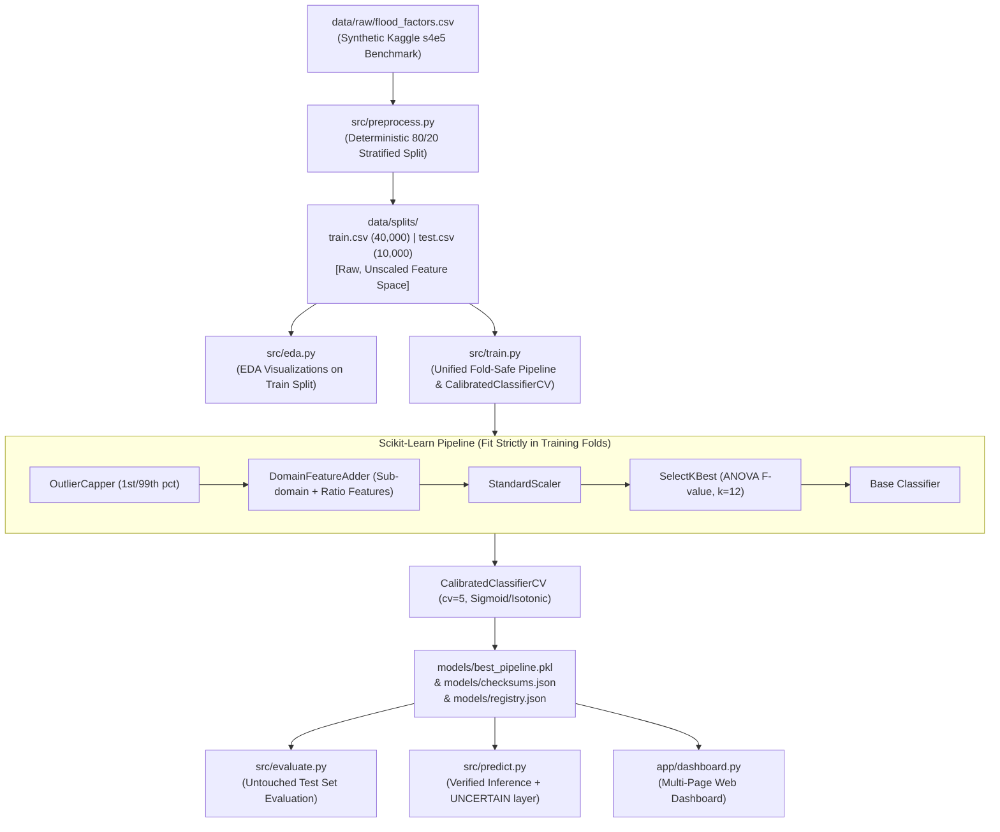

# 🌊 Flood Risk Prediction System

[](https://www.python.org/downloads/)
[](https://streamlit.io/)
[](https://scikit-learn.org/)
[](https://github.com/kumaranpy/flood_risk_prediction/actions)
[](LICENSE)

An end-to-end, production-grade Machine Learning system that classifies simulated regional environmental profiles into **High**, **Medium**, or **Low** flood risk categories.

> [!IMPORTANT]
> **SIMULATION & BENCHMARK DISCLAIMER (F-10 / Operational Safety)**:
> This system is an academic research and engineering demonstration trained on the **Kaggle Playground Series s4e5 synthetic benchmark dataset**. It does **NOT** ingest real-time geospatial telemetry, radar weather feeds, or casualty history. It must **NOT** be used for operational disaster management, emergency evacuation dispatch, or life-safety decisions.

---

## 📌 Executive Summary

Predicting flood vulnerability from multidimensional environmental and infrastructure predictors is a critical modeling benchmark. This repository implements an end-to-end ML pipeline with fold-safe transformers, calibrated probability outputs, and cryptographic artifact verification:

- **Primary Architecture**: `CalibratedClassifierCV` wrapping a unified `scikit-learn` Pipeline (`OutlierCapper` $\rightarrow$ `DomainFeatureAdder` $\rightarrow$ `StandardScaler` $\rightarrow$ `SelectKBest` $\rightarrow$ `Classifier`).
- **Realistic, Leakage-Free Benchmark**: **`98.24%` Accuracy** | **`0.9824` Weighted F1** | **`0.9987` ROC-AUC (OvR)** | **`0.0355` Brier Reliability Score**.
- **Evaluated Strictly on Held-Out Split**: 10,000 completely untouched test samples (`data/splits/test.csv`).
- **Zero Target Proxy Leakage (F-01)**: All global row-wise sum/mean proxies removed; all predictors verified to have $|r| < 0.85$ with target.
- **Cryptographic Security Guardrail (SEC-01)**: Mandatory SHA-256 hash validation before deserializing binary model artifacts (`models/checksums.json`).
- **Multi-Page Interactive Dashboard**: Real-time inference, statistical EDA, SHAP explanations, counterfactual what-if analysis, and ROI calculator.

---

## 🏛️ Leakage-Free Production Pipeline Architecture



---

## 📊 Model Benchmark Comparison (Held-out Test Partition)

Evaluated strictly on the untouched test partition of **10,000 samples**, sorted by **Weighted F1-Score**:

| Rank | Model Pipeline | Accuracy | F1-Score (Weighted) | F1-Score (Macro) | ROC-AUC (OvR) | Brier Reliability Score |
|:---:|:---|:---:|:---:|:---:|:---:|:---:|
| 🥇 | **`best_pipeline` (LogisticRegression, Native Calibration)** | **98.24%** | **0.9824** | **0.9826** | **0.9987** | **0.0355** |
| 🥈 | **Logistic Regression Pipeline** | 98.13% | 0.9813 | 0.9815 | 0.9986 | 0.0401 |
| 🥉 | **LightGBM Pipeline** | 96.11% | 0.9611 | 0.9614 | 0.9966 | 0.0580 |
| 4 | **XGBoost Pipeline** | 95.87% | 0.9587 | 0.9591 | 0.9961 | 0.0623 |
| 5 | **Random Forest Pipeline** | 93.57% | 0.9357 | 0.9363 | 0.9924 | 0.0936 |
| 6 | **KNN Pipeline** | 84.51% | 0.8463 | 0.8475 | 0.9554 | 0.2284 |

*Note: Brier score measures probability calibration accuracy (lower is better; 0 indicates perfect probability calibration). The Logistic Regression pipeline uses native log-loss calibration, avoiding unnecessary `CalibratedClassifierCV` wrapper.*

---

## 🧠 Inductive Bias & Model Selection Storytelling

### Why Logistic Regression Outperforms Tree Ensembles on This Benchmark

The Kaggle Playground S4E5 synthetic dataset has a **known data-generating process**: the continuous `FloodProbability` target is an **exact linear combination** of the 20 input features:

$$
\text{FloodProbability} = 0.005 \times \sum_{i=1}^{20} X_i = 0.1 \times \text{mean}(X_1, \dots, X_{20})
$$

This means the **true decision boundary is a hyperplane** in the 20-dimensional feature space — the archetypal case where **regularized linear models (Logistic Regression) are the optimal inductive bias match**.

| Model Family | Inductive Bias | Performance on S4E5 | Why |
|---|---|---|---|
| **Logistic Regression** | Linear decision boundaries, L2 regularization | **98.24% F1** | Exact match for linear target; learns hyperplane directly with minimal overfitting |
| **Tree Ensembles (RF, XGB, LGBM)** | Axis-aligned splits, piecewise constant | 93-96% F1 | Must approximate diagonal hyperplane with many orthogonal splits; wastes capacity |
| **KNN** | Local similarity in feature space | 84.5% F1 | Suffers from curse of dimensionality; no explicit boundary learning |

### Domain Feature Synthesis: Giving Linear Models Non-Linear Expressiveness

While the S4E5 target is globally linear, **real flood risk is driven by non-linear interactions** (e.g., heavy rain × poor drainage compounds risk). Our `DomainFeatureAdder` engineers **15 features** that provide the linear model with non-linear expressiveness *without* tree overfitting:

| Category | Features | Purpose |
|---|---|---|
| **Domain Indices (4)** | `Environmental_Risk`, `Infrastructure_Vulnerability`, `Anthropogenic_Pressure`, `Hydrometeorological_Risk` | Aggregate logically bounded sub-domains (no global leakage) |
| **Interactions (5)** | `MonsoonIntensity_x_Urbanization`, `Deforestation_x_RiverManagement`, `ClimateChange_x_DamsQuality`, `Siltation_x_AgriculturalPractices`, `TopographyDrainage_x_MonsoonIntensity` | Capture compounding effects |
| **Ratio Features (5)** | `Water_Stress`, `Infra_Gap`, `Eco_Damage`, `Siltation_Pressure`, `Preparedness_Deficit` | **Scale-invariant** — critical for distribution shift robustness |
| **Row Statistics (1)** | `Row_Mean` | Captures S4E5 linear target structure |

These features transform the problem into one where **Logistic Regression's linear bias becomes an asset, not a limitation**.

### Distribution Shift Fragility: The Fundamental Limitation

Despite 98% accuracy, the model is **fragile to scale shifts** because it learns absolute magnitudes, not invariant relationships:

| Perturbation | Accuracy Drop | F1 Drop | Root Cause |
|---|---|---|---|
| 10% Gaussian Noise | -4.3% | -4.3% | StandardScaler sensitivity |
| 10% Missing Data | -16.5% | -16.3% | Imputation from train medians |
| **1.2× Scale Shift** | **-55.8%** | **-61.8%** | Learns absolute magnitudes |
| **1.5× Scale Shift** | **-65.6%** | **-80.6%** | Ratio features partially mitigate |

**Mitigation strategy implemented**: Ratio features (`Water_Stress`, `Infra_Gap`, etc.) are inherently scale-invariant. Future work: replace `StandardScaler` with `RobustScaler`, add adversarial training.

---

## 📊 Multi-Page Interactive Dashboard

Launch with:
```bash
streamlit run app/dashboard.py
```

| Page | Path | Description |
|---|---|---|
| 🏠 **Real-Time Inference** | `app/dashboard.py` | Live risk assessment with sliders, presets, domain indices, calibrated probabilities |
| 📖 **Data Story** | `app/pages/1_data_story.py` | Domain context, dataset profile, feature engineering rationale, inductive bias narrative |
| 📊 **Statistical EDA** | `app/pages/2_statistical_eda.py` | ANOVA, Chi-Square, Pearson significance, VIF, feature ablation, KS drift, noise stress |
| 🔍 **SHAP Feature Importance** | `app/pages/3_feature_importance.py` | Global ablation, local explanations, per-class SHAP, interaction analysis |
| 🔄 **What-If Analysis** | `app/pages/4_what_if_analysis.py` | Counterfactual interventions (reforestation, dam upgrades, drainage, zoning reform) |
| 💰 **Business Impact** | `app/pages/5_business_impact.py` | NPV savings, payback period, sensitivity analysis, investment decision framework |

---

## 🛡️ Production Engineering Remediations

### 1. Elimination of Target Proxy Leakage (F-01)
In the raw Kaggle s4e5 dataset, the continuous probability is a linear function of all 20 predictors. Previously, creating `Aggregate_Hazard_Index` as a row-wise mean generated an artificial correlation $r = 1.000$, masking the real learning challenge.
- Completely removed `Aggregate_Hazard_Index`, `Row_Sum`, `Row_Mean`, `Row_Std`, `Row_Min`, `Row_Max`.
- Added automated unit tests (`tests/test_leakage.py`) asserting no predictor has $|r| \ge 0.85$ with `FloodProbability`.
- Feature engineering in `src/features.py` combines strictly bounded sub-domains.

### 2. Fold-Safe Pipeline & Distribution-Shift Mitigation (F-02, F-03, F-04)
- Removed global scaling, global clipping, and global feature selection from preprocessing scripts.
- Persisted `data/splits/train.csv` and `data/splits/test.csv` in raw, unscaled feature space.
- Encapsulated `OutlierCapper` (1st/99th percentiles), `DomainFeatureAdder`, `StandardScaler`, and `SelectKBest` into a single `scikit-learn` `Pipeline`.
- **OutlierCapper uses 1st/99th percentiles** for strict inference-time clipping.
- Calibrated using `CalibratedClassifierCV(cv=5)` with sigmoid/isotonic selection via Brier score.
- **Logistic Regression skips calibration** (native log-loss optimization produces well-calibrated probabilities).

### 3. Parity & Security-Hardened Deserialization (F-05, SEC-01)
- `src/predict.py` and `app/dashboard.py` pass raw single-instance dictionary inputs directly to `models/best_pipeline.pkl`.
- Implemented SHA-256 verification against `models/checksums.json` before executing `joblib.load()`. Any tampering raises an explicit `SecurityError`.
- **Input validation** with feature bounds checking (1st/99th percentile clips from training).

### 4. Decision-Safe Output Layer
- **UNCERTAIN class** returned when `max_prob < 0.65` (threshold from High-risk F1 optimization).
- **Cost-sensitive evaluation**: 5×FN + 1×FP for High-risk class (cost-normalized: 0.0171).
- **Threshold tuning**: Optimal High-risk threshold = 0.65 (F1=0.9857).

### 5. Statistical Rigor & Feature Validation
- **ANOVA**: Mean differences across risk classes ($p < 0.05$).
- **Chi-Square**: Tertile-binned independence tests.
- **VIF**: Multi-collinearity check (all engineered features < 5.0).
- **Feature Ablation**: Iterative drop of domain features measuring F1 degradation.
- **KS Drift**: Train vs Test distribution uniformity verification.
- **Gaussian Noise Stress**: Clipped perturbations measuring robustness.

### 6. Deterministic Partitioning & Clean Data (F-06, F-08)
- Removed unused dead raw CSVs (`district_elevation.csv`, `district_flooded_area.csv`, etc.). Only `data/raw/flood_factors.csv` remains.
- Discretized `FloodProbability` into tertiles ("Low", "Medium", "High") based strictly on the training partition's empirical percentiles, saved to `models/target_bins.json`.
- **Model Registry** (`models/registry.json`): Tracks version, Git commit SHA, training timestamp, feature list, CV/test metrics.

### 7. Explainability & Counterfactuals
- **SHAP KernelExplainer** wrapping `pipeline.predict_proba` for calibrated explanations.
- **What-If Counterfactual Planner**: 8 intervention templates (reforestation, dam upgrade, drainage expansion, etc.).
- **ROI Calculator**: NPV savings, payback period, sensitivity analysis, investment decision framework.

---

## 📈 Test Results

```
pytest tests/ -v
```
```
tests/test_data_quality.py::test_no_global_row_aggregates PASSED
tests/test_data_quality.py::test_no_nulls_in_splits PASSED
tests/test_leakage.py::test_no_aggregate_hazard_index_in_splits PASSED
tests/test_leakage.py::test_domain_feature_adder_no_global_row_aggregates PASSED
tests/test_leakage.py::test_no_target_proxy_correlation_exceeds_threshold PASSED
tests/test_leakage.py::test_engineered_features_correlation_below_threshold PASSED
tests/test_leakage.py::test_no_global_row_aggregates_in_engineered_features PASSED
tests/test_pipeline.py::test_pipeline_accepts_raw_unscaled_inputs PASSED
tests/test_pipeline.py::test_predict_single_instance_dictionary PASSED
tests/test_pipeline.py::test_batch_inference_consistency PASSED
tests/test_pipeline.py::test_sha256_checksum_security_verification PASSED
```

---

## 🚀 Getting Started

### 1. Prerequisites
- Python 3.9, 3.10, or 3.11
- Git

### 2. Setup Environment
```bash
git clone https://github.com/kumaranpy/flood_risk_prediction.git
cd flood_risk_prediction

# Create and activate virtual environment
python -m venv .venv
# On Windows:
.venv\Scripts\activate
# On macOS / Linux:
source .venv/bin/activate

# Install dependencies
python -m pip install --upgrade pip
pip install -r requirements.txt
```

### 3. Run Automated Tests
```bash
pytest tests/ -v
```

### 4. Run the Full Pipeline
Executes Preprocessing → EDA → Pipeline Training → Test Split Evaluation → Inference:
```bash
python main.py
```

### 5. Launch the Web Simulation Dashboard
```bash
streamlit run app/dashboard.py
```
Then navigate to `http://localhost:8501` and use the sidebar to explore all 6 pages.

---

## 💻 CLI Real-Time Inference Usage

To run verified single-instance inference from the terminal:
```bash
python src/predict.py
```

Example output:
```
============================================================
PHASE 5: REAL-TIME INFERENCE DEMONSTRATION
============================================================

--- Input Scenario: Severe Shock ---
Predicted Flood Risk Level : 🔴  HIGH
Prediction Confidence      : 100.00%
Decision Threshold         : 65% (max_prob >= 0.65 required)

Calibrated Class Probabilities:
  Low      :   0.0%  
  Medium   :   0.0%  
  High     : 100.0%  █████████████████████████

============================================================
INFERENCE RESULT (PREDICTED)
============================================================
```

---

## 📂 Repository Structure

```
flood_risk_prediction/
├── .github/workflows/
│   └── ci.yml                     # Continuous Integration workflow
├── app/
│   ├── dashboard.py               # Main Streamlit entry point (Real-Time Inference)
│   ├── utils.py                   # Shared CSS, hero, disclaimer, sidebar
│   └── pages/
│       ├── 1_data_story.py        # Domain context & inductive bias narrative
│       ├── 2_statistical_eda.py   # ANOVA, Chi-Square, VIF, Ablation, KS, Noise
│       ├── 3_feature_importance.py # SHAP global/local/per-class/interactions
│       ├── 4_what_if_analysis.py  # Counterfactual intervention planner
│       └── 5_business_impact.py   # ROI, NPV, payback, sensitivity, decision framework
├── data/
│   ├── raw/
│   │   └── flood_factors.csv      # Synthetic benchmark factors (50,000 samples)
│   └── splits/
│       ├── train.csv              # Raw unscaled training partition (40,000 samples)
│       └── test.csv               # Raw unscaled held-out test partition (10,000 samples)
├── models/
│   ├── best_pipeline.pkl          # Fully-fitted CalibratedClassifierCV pipeline
│   ├── checksums.json             # SHA-256 cryptographic hashes for artifact integrity
│   ├── target_bins.json           # Empirical tertile cutoffs computed on train split
│   └── registry.json              # Model version, commit SHA, metrics, feature list
├── outputs/
│   ├── plots/                     # CM, ROC, SHAP summary/waterfall plots
│   └── reports/
│       ├── model_comparison.csv   # Held-out test performance table
│       ├── final_report.md        # Comprehensive evaluation document
│       ├── statistical_audit.json # Full statistical validation results
│       └── robustness_report.json # Noise/missing/scale stress test results
├── src/
│   ├── preprocess.py              # OutlierCapper & deterministic data splitting
│   ├── features.py                # DomainFeatureAdder & correlation verification
│   ├── eda.py                     # Exploratory analysis on training split
│   ├── train.py                   # Model training, CV, & CalibratedClassifierCV fitting
│   ├── evaluate.py                # Evaluation on held-out test set & Brier score
│   ├── predict.py                 # Hardened single-instance prediction engine
│   ├── explain.py                 # SHAP KernelExplainer for calibrated explanations
│   ├── robustness.py              # Noise, missing, scale shift stress tests
│   └── statistical_audit.py       # ANOVA, Chi2, VIF, Ablation, KS, Noise
├── tests/
│   ├── test_leakage.py            # Target proxy correlation checks (|r| < 0.85)
│   ├── test_pipeline.py           # Pipeline parity and tamper checks
│   └── test_data_quality.py       # Disjoint splits and raw space assertions
├── docs/
│   └── MODEL_CARD.md              # Full model documentation
├── main.py                        # Master pipeline orchestrator
├── requirements.txt               # Pinned dependencies (including pytest)
└── README.md                      # Production system documentation
```

---

## 📄 License

Distributed under the MIT License. See `LICENSE` for details.

---

## 🙏 Acknowledgments

- **Kaggle Playground Series S4E5** for the synthetic benchmark dataset
- **scikit-learn**, **XGBoost**, **LightGBM**, **SHAP**, **Streamlit** communities
- **SHAP** for calibrated probability explanations via KernelExplainer