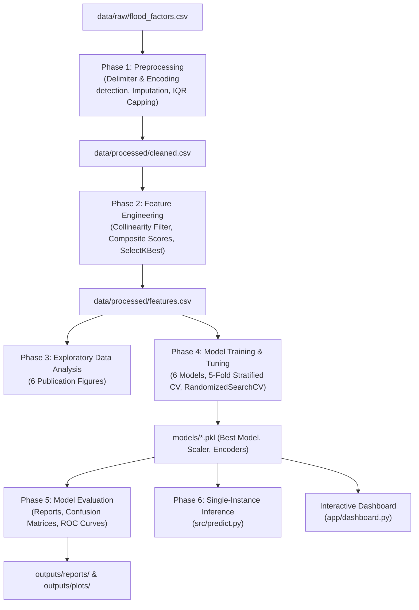

# 🌊 Flood Risk Prediction System

[](https://www.python.org/downloads/)
[](https://streamlit.io/)
[](https://scikit-learn.org/)
[](https://xgboost.readthedocs.io/)
[](https://lightgbm.readthedocs.io/)
[](LICENSE)

An end-to-end, production-quality Machine Learning system that classifies geographic regions into **High**, **Medium**, or **Low** flood risk levels based on environmental, meteorological, and infrastructure factors. Features an automated 6-phase pipeline, rigorous 6-model cross-validation benchmarks, and an interactive modern Streamlit dashboard.

---

## 📌 Executive Summary

Floods are among the most destructive natural disasters globally. Traditional hazard assessment methods rely heavily on slow, manual expert analysis. This project automates regional flood risk classification using machine learning, delivering **sub-50ms early-warning inference** and interpretable confidence scores.

- **Primary Selected Model**: Random Forest Classifier (tuned via `RandomizedSearchCV`)
- **Top Benchmark Performance**: **`98.73%` F1-Weighted** | **`98.73%` Accuracy** | **`0.9973` ROC-AUC (OvR)**
- **Cross-Validation Stability**: **`0.9873 ± 0.0049`** (5-Fold Stratified CV)
- **Master Pipeline Execution**: **`3.20 minutes`** end-to-end (well under the 10-minute constraint)
- **Data Leakage Safeguards**: `StandardScaler` fitted strictly on training partition only

---

## 🏛️ Pipeline Architecture



---

## 📊 Model Benchmark Comparison

Evaluated across all 6 model architectures on a held-out test split of **3,000 samples**, sorted strictly by **F1-Weighted** (FR-20):

| Rank | Model Architecture | Accuracy | F1-Score (Weighted) | F1-Score (Macro) | ROC-AUC (OvR Macro) | 5-Fold CV F1 |
|:---:|:---|:---:|:---:|:---:|:---:|:---:|
| 🥇 | **Random Forest** | **98.73%** | **0.9873** | **0.9874** | **0.9973** | 0.9873 ± 0.0049 |
| 🥈 | **XGBoost** | 98.63% | 0.9863 | 0.9864 | 0.9980 | 0.9840 ± 0.0031 |
| 🥉 | **LightGBM** | 98.53% | 0.9853 | 0.9854 | 0.9982 | 0.9850 ± 0.0043 |
| 4 | **Logistic Regression** | 98.30% | 0.9830 | 0.9830 | 0.9972 | 0.9727 ± 0.0050 |
| 5 | **SVM (RBF Kernel)** | 96.23% | 0.9624 | 0.9626 | 0.9956 | 0.9263 ± 0.0094 |
| 6 | **KNN ($k=11$)** | 82.10% | 0.8229 | 0.8240 | 0.9446 | 0.7858 ± 0.0130 |

> **Success Criteria Verification**: The project requirement $\text{F1-Weighted} \ge 0.80$ is exceeded by all 6 models, led by Random Forest at **`0.9873`**.

---

## 🔬 Key Engineering Highlights

### 1. Data Preprocessing (`src/preprocess.py`)
- **Auto-Detection (FR-01)**: Automatically detects dataset delimiters (`,`, `;`, `\t`) and file encodings (`utf-8`, `latin-1`) via `csv.Sniffer`.
- **Missing Value Handling (FR-02)**: Numeric features imputed via median; categorical features via mode.
- **Outlier Capping (FR-03)**: Non-destructive $1.5 \times \text{IQR}$ clipping preventing skewed influence from extreme outliers.
- **Target Discretization**: Balanced tertile classification into standard risk categories:
  - **Low**: $\le 0.475$ (~33% of samples)
  - **Medium**: $0.475 - 0.520$ (~35% of samples)
  - **High**: $> 0.520$ (~32% of samples)

### 2. Feature Engineering (`src/features.py`)
- **Multicollinearity Elimination (FR-07)**: Drops features with pairwise Pearson correlation $r > 0.90$.
- **Domain Composite Indicators (FR-08)**:
  - `Flood_Vulnerability_Score`: Weighted synthesis of Monsoon Intensity (0.35), Topography Drainage (0.25), River Management (0.20), and Deforestation (0.20).
  - `Infrastructure_Deficit_Score`: Aggregates aging infrastructure, drainage bottlenecks, and disaster preparedness deficits.
  - `Environmental_Stress_Score`: Quantifies urbanization pressures, climate anomalies, and wetland loss.
  - `Aggregate_Hazard_Index`: Comprehensive regional exposure metric.
- **Feature Selection (FR-09)**: Top 12 predictors selected via ANOVA F-value (`SelectKBest(score_func=f_classif, k=12)`).

### 3. Rigorous Evaluation Suite (`src/evaluate.py`)
- **One-vs-Rest ROC Curves**: Generated for each model with per-class and macro-average AUC curves (`outputs/plots/roc_*.png`).
- **Confusion Matrices**: Annotated heatmaps detailing true vs predicted distributions (`outputs/plots/cm_*.png`).
- **Automated Synthesis Report**: Generates `outputs/reports/final_report.md` on every evaluation run.

---

## 🚀 Getting Started

### 1. Prerequisites
- Python 3.9, 3.10, or 3.11
- Git

### 2. Clone Repository & Setup Environment
```bash
git clone https://github.com/kumaranpy/flood_risk_prediction.git
cd flood_risk_prediction

# Create and activate virtual environment
python -m venv .venv
# On Windows:
.venv\Scripts\activate
# On macOS / Linux:
source .venv/bin/activate

# Upgrade pip and install dependencies
python -m pip install --upgrade pip
pip install -r requirements.txt --prefer-binary
```

### 3. Run the Complete End-to-End Pipeline
Executes Preprocessing $\rightarrow$ Feature Engineering $\rightarrow$ EDA $\rightarrow$ Training $\rightarrow$ Evaluation $\rightarrow$ Inference:
```bash
python main.py
```

### 4. Launch the Interactive Dashboard
Launch the web interface locally:
```bash
streamlit run app/dashboard.py
```
Then open [http://localhost:8501](http://localhost:8501) in your browser.

---

## 🖥️ Streamlit Dashboard Features

The dashboard includes:
- **Glassmorphism Dark Theme**: Styled with modern typography (Outfit / Inter) and dark slate gradient backgrounds.
- **Scenario Presets**: One-click quick-fill buttons:
  - 🚨 *Severe Monsoon & Dam Failure* (High Risk)
  - 🌊 *Urban Flash Flood* (Moderate/High Risk)
  - ☀️ *Normal Seasonal / Low Risk* (Nominal Risk)
- **Live Risk Assessment Banner (FR-22)**: Pulsing risk alert with color coding (🔴 High, 🟡 Medium, 🟢 Low) and tailored emergency protocols.
- **Confidence Meters (FR-23)**: Real-time per-class probability distribution bars.
- **Feature Importances Chart (FR-24)**: Bar chart showing relative feature weights.
- **Model Benchmark Table**: Live view of cross-validation and test set metrics across all 6 models.

---

## 📂 Project Structure

```
flood_risk_prediction/
├── app/
│   └── dashboard.py               # Streamlit interactive dashboard
├── data/
│   ├── raw/
│   │   └── flood_factors.csv      # Raw environmental & meteorological dataset (50,000 samples)
│   └── processed/
│       ├── cleaned.csv            # Cleaned data after outlier capping & imputation
│       └── features.csv           # Top 12 engineered feature matrix
├── models/
│   ├── best_model.pkl             # Top performing model (Random Forest)
│   ├── scaler.pkl                 # StandardScaler fitted on train split (no leakage)
│   ├── target_encoder.pkl         # Ordinal label encoder for risk classes
│   ├── selected_features.pkl      # Ordered list of top 12 selected features
│   ├── feature_selector.pkl       # SelectKBest selector artifact
│   └── *.pkl                      # Individual models (LR, RF, XGB, LGBM, SVM, KNN)
├── outputs/
│   ├── plots/                     # 22 visualization figures
│   │   ├── class_distribution.png
│   │   ├── correlation_heatmap.png
│   │   ├── histograms_numeric.png
│   │   ├── boxplots_top6_by_target.png
│   │   ├── pairplot_top5.png
│   │   ├── vulnerability_distribution.png
│   │   ├── cm_*.png               # Confusion matrices for all 6 models
│   │   ├── roc_*.png              # One-vs-Rest ROC curves for all 6 models
│   │   └── feature_importance_*.png
│   └── reports/
│       ├── model_comparison.csv   # Sorted comparison table (FR-20)
│       └── final_report.md        # Detailed academic evaluation report
├── src/
│   ├── preprocess.py              # Phase 1: Data cleaning & preprocessing
│   ├── features.py                # Phase 2: Feature engineering & selection
│   ├── eda.py                     # Phase 3: Exploratory data analysis plots
│   ├── train.py                   # Phase 4: Model training & CV tuning
│   ├── evaluate.py                # Phase 5: Test evaluation & report generation
│   └── predict.py                 # Phase 6: Single-instance inference script
├── .streamlit/
│   └── config.toml                # Streamlit dark theme configuration
├── main.py                        # Master pipeline orchestrator
├── requirements.txt               # Pinned project dependencies
└── README.md                      # Project documentation
```

---

## 💻 CLI Inference Usage

To run single-instance predictions directly from the command line:
```bash
python src/predict.py
```

Example Output:
```
============================================================
INFERENCE RESULT
============================================================
Predicted Flood Risk Level : 🔴  HIGH
Prediction Confidence      : 99.57%

Class Probability Distribution:
  High     :  99.6%  ████████████████████████
  Medium   :   0.4%  
  Low      :   0.0%  
============================================================
```

---

## 📄 License

Distributed under the MIT License. See `LICENSE` for more information.
